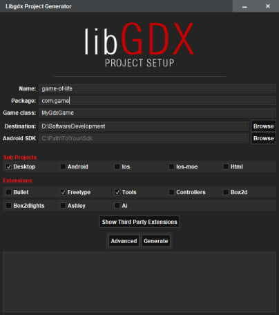
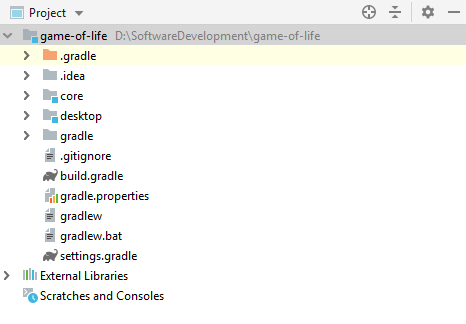
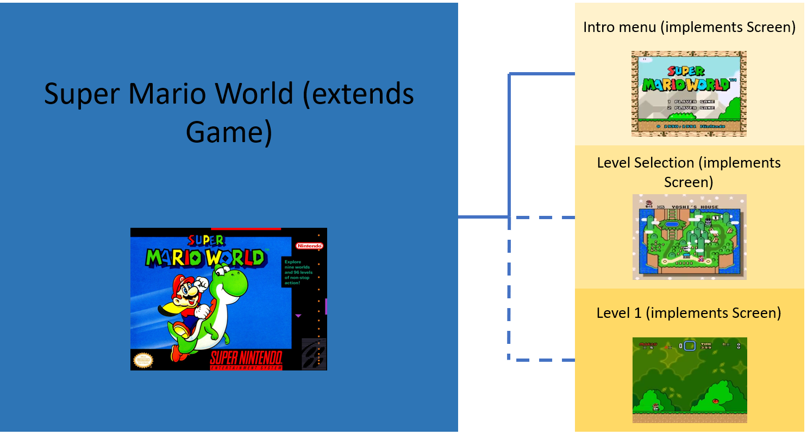
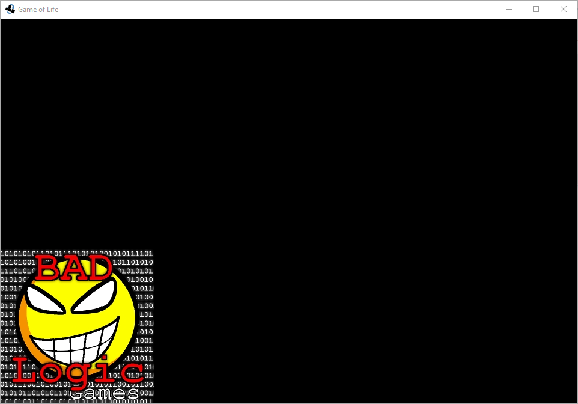
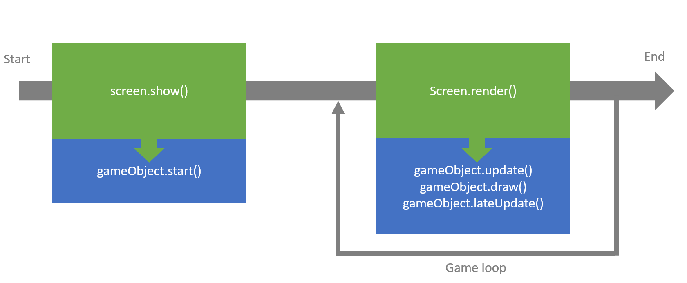
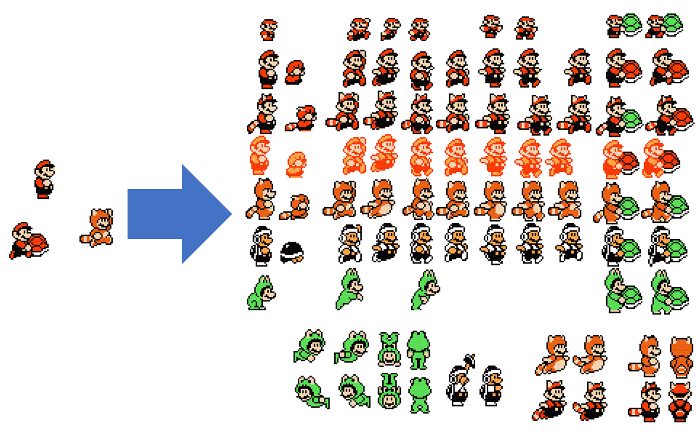
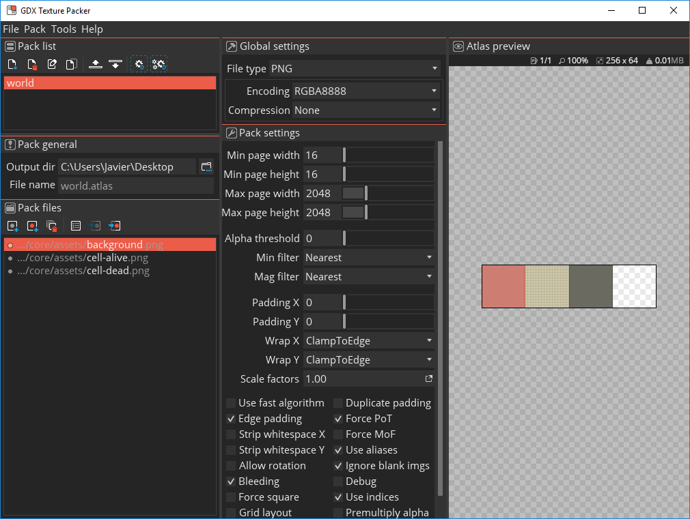
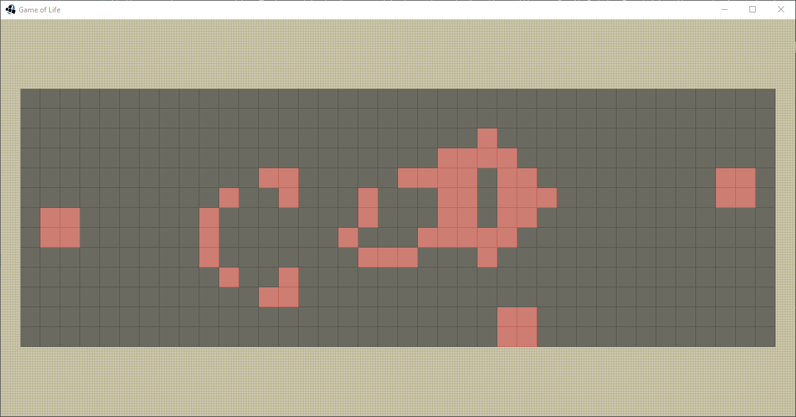

# This Project

This project is a personal initiative to develop a deeper understanding of the LibGDX framework developing Conway’s Game of life and a way to give something back to the community. I started learning LibGDX in 2016 because I wanted to learn a more low-level framework instead of using a tool like Unity, at the cost of a more steep learning curve and I think that it is a really valuable approach.

The tutorial will cover LibGDX’s basics as sprite rendering, particles, shaders, user input, audio, file I/O, font rendering, asset management and user interfaces. In addition, this will cover the development of the Game of life logic using unit tests.

I am going to focus in discussing the things that I consider more important and not to focus on going step by step creating a game, so if you are new to this framework I recommend you to start with “Full Libgdx Game Tutorial” (link at the bottom). I consider that there are plenty of tutorials to create your first game using this framework but not many discuss the decision process when using the tools that it provides. Nevertheless, if something is not clear write down a comment and I will try to explain something in more detail.
## About Conway’s Game of Life

The Game of Life is a zero-player game in which its evolution is determined by its initial state. The universe of the game is an infinite, two-dimensional orthogonal grid of square cells, each one of them can have one of two possible states: alive or dead. The interaction between cells is only possible to the adjacent cells and is determined by this set of rules:

1. Underpopulation: if a living cell is surrounded by fewer than two living cells, it dies.
2. Stasis: if a living cell is surrounded by two or three living cells, it survives.
3. Overpopulation: if a living cell is surrounded by more than three living cells, it dies.
4. Reproduction: if a dead cell is surrounded by exactly three cells, it becomes a live cell.

This game is a perfect exercise for learning a new language, learning to do unit testing and pair programming. It has the disadvantage of not having interaction with the “player”, but there are things to add to introduce input in the game.
## About LibGDX

LibGDX is a Java framework for game development. Is open sourced and cross-platform, allowing development to Windows, Mac, Linux, Android, iOS and HTML5 with a single codebase. The framework consists of six interfaces, covering the main aspects needed for developing a game:

* Application.
* Files.
* Input.
* Net.
* Audio.
* Graphics.

It’s not necessary to use all the interfaces when developing a game, but it’s important to know at least what tools are available and later decide whether to stick to these or use another interface.
Resources

* [LibGDX’s official wiki](https://github.com/libgdx/libgdx/wiki)
* [A really good tutorial “Full LibGDX Game Tutorial”](https://www.gamedevelopment.blog/full-libgdx-game-tutorial-flgt-home/)
* [The book “Libgdx Cross-platform Game Development Cookbook”](https://www.packtpub.com/game-development/libgdx-cross-platform-game-development-cookbook)

# Setup and the first Screen

In this chapter, we are going to create a libGDX project using the Gradle project generator, discuss the platform dependant interfaces, explain the core classes of any game and draw a simple image using the drawing classes of the framework.
The setup

* MSI laptop with 7700HQ and GTX 1050Ti.
* Windows 10.
* Jetbrains’s IntelliJ Community 2018.3 EAP.
* JRE: 1.8.0.
* LibGDX Gradle project generator 1.6.1.

## Generate the project

The first thing to do is to download LibGDX from the official web. It is especially recommended to use the Gradle utility in which you have to select the dependencies you want to use and platforms you want to target.

In this case, we are going to target desktop only and use the Freetype and Tools extensions. The Freetype is a utility to create bitmap images (in .png) from.ttf font files. The tools extensions include the particles editor and textures packers for our sprites.



Once the project is created in the location specified is time to import it with our IDE, in our case IntelliJ. The first time the project is opened all the dependencies are going to be downloaded via Gradle. After it has finished it is appropriate to create a git repository and commit the project.

The project structure has a common package named “core” and a package for each platform, in this case, we have a “desktop” package.



Now we can start programming.
## The application

The Starter Classes are specific pieces of code for each platform supported. For each platform, there is a class that instantiates a concrete implementation of the Application interface. For the desktop, the starter class calls the Lwjgl (Lightweight Java Game Library) back-end platform. This class has been automatically created and looks like this:

```
package com.game.desktop;

import com.badlogic.gdx.backends.lwjgl.LwjglApplication;
import com.badlogic.gdx.backends.lwjgl.LwjglApplicationConfiguration;
import com.game.MyGdxGame;

public class DesktopLauncher {
   public static void main (String[] arg) {
      LwjglApplicationConfiguration config = new LwjglApplicationConfiguration();
      new LwjglApplication(new MyGdxGame(), config);
   }
}
```
As we see on the class from above, a LwjglApplicationConfiguration is instantiated, which contains all the configuration of the application as dimensions, title, etc and later a LwjglApplication.

The LwjglApplication requires two parameters, the configuration class and MyGdxGame class, which is the class that implements an ApplicationListener class, the logic of the application. This logic is called the “life cycle” of the application.

The life cycle of the application includes its own creation, its main loop actions, resizing actions, pausing and resuming (because of the loss of focus of the app, for example) and its removal. Refer to the official docs for more information: [wiki](https://github.com/libgdx/libgdx/wiki/The-life-cycle).

The most important method for us is the render() method which can be regarded as the body of the main loop of the application. Is the method that is going to be executed every frame and is not going to do the rendering logic but all the other logic of the game.
## The Game and Screen classes

The first approach would be to work directly with the ApplicationListener, pouring all our code in the render method, but when a game has multiples screens (like different levels, menus, etc), and different components is better to extract to a specific class (screen) all the information that it needs and let the ApplicationListener render one screen or another. The people behind LibGDX thought about this and developed a couple of classes and interfaces to make it easier.

The Game class is a class that implements ApplicationListener and adds a couple of methods for handling different screens. The Game class lets you set the Screen class that is rendering, change it and remove it. These two classes are the core of the game.

For example, in Super Mario World there would be a Game class and one screen for the menu, another for the world map for the level selection and another for each level. The Game class renders one of the screens (the continuous line) and can have more screens instantiated but paused (the dotted line).



The Screen classes are going to hold the objects necessary for one “level” or “scene”. In our case, a screen is going to contain the cells and is going to execute the game logic to them.

In our case, we are going to create a Screen class named World to hold our Game of Life. This is how it looks the World class implementing the Screen interface.

```
package com.game;

import com.badlogic.gdx.Screen;

public class World implements Screen {
    @Override
    public void show() {

    }

    @Override
    public void render(float delta) {

    }

    @Override
    public void resize(int width, int height) {

    }

    @Override
    public void pause() {

    }

    @Override
    public void resume() {

    }

    @Override
    public void hide() {

    }

    @Override
    public void dispose() {

    }
}

Our MyGdxGame has to extend Game instead of ApplicationListener and we have to instantiate a World class inside it a set it as our screen.

package com.game;

import com.badlogic.gdx.Game;
import com.badlogic.gdx.Gdx;
import com.badlogic.gdx.Screen;

public class MyGdxGame extends Game {
    Screen world;

    @Override
    public void create() {
        world = new World();
        setScreen(world);
    }

    @Override
    public void render() {
        float delta = Gdx.graphics.getDeltaTime();
        getScreen().render(delta);
    }

    @Override
    public void dispose() {
        getScreen().dispose();
    }
}
```

When the Game class is instantiated the create method is launched and a new World is created, being assigned to the screen field of the Game. Later, at each render call, the screen own render method is going to be called. As explained before, this brings the capacity of having a couple of screens, being able to switch between them and rendering only the one that is assigned to the Game.

## Rendering with SpriteBatch and Texture

The bread and butter of rendering is the use of SpriteBatch and Texture. A detailed description of both can be found in the official wiki ([link](https://github.com/libgdx/libgdx/wiki/Spritebatch,-Textureregions,-and-Sprites)).

In essence, the SpriteBatch stores all the images that are going to be drawn and passes them to the GPU. A Texture object wraps an image to decode it and send it to the GPU memory, as simple as that.

The SpriteBatch’s draw method renders a texture at the specified coordinates. It also possible to pass more parameters like width, height, flip the texture, scale, rotation… But it is better to think about the texture as a sprite sheet. The draw call must be between the begin and end methods in order to group as many sprites as possible in a single operation. It is also important to use the same texture between these calls because changing to another texture has a performance impact. It’s possible to learn more with this response: [link](https://gamedev.stackexchange.com/a/24301).

The World screen in our game is going to have a SpriteBatch and the different textures we want to draw.

```
package com.game;

import com.badlogic.gdx.Gdx;
import com.badlogic.gdx.Screen;
import com.badlogic.gdx.graphics.GL20;
import com.badlogic.gdx.graphics.Texture;
import com.badlogic.gdx.graphics.g2d.SpriteBatch;

public class World implements Screen {
    private SpriteBatch worldSpriteBatch;
    private Texture texture = new Texture(Gdx.files.internal("badlogic.jpg"));

    World() {
        worldSpriteBatch = new SpriteBatch();
    }

    @Override
    public void show() {

    }

    @Override
    public void render(float delta) {
        Gdx.gl.glClear(GL20.GL_COLOR_BUFFER_BIT); // This cryptic line clears the screen.
        worldSpriteBatch.begin();
        worldSpriteBatch.draw(texture, 0, 0);
        worldSpriteBatch.end();
    }

    @Override
    public void resize(int width, int height) {

    }

    @Override
    public void pause() {

    }

    @Override
    public void resume() {

    }

    @Override
    public void hide() {

    }

    @Override
    public void dispose() {

    }
}
```

The “badlogic.jpg” is an example image that is provided by the framework. The result must look like this:



## Conclusion

The most important lesson is the hierarchy of Game/Screen classes as a way to decouple responsabilities. The Game class is responsible to know what screen to render and the Screen class is responsible of the objects inside it, how to draw them and the logic involving them. Nevertheless, for the Screen class to follow the SOLID principles, these tasks must be separated in different classes.

# Game Logic with Test Driven Development

In this chapter, we are going to program the logic or rules behind the Game of Life using unit Test Driven Development (TDD). The rules are turned into very specific test cases, then code is written to pass the tests. This is an iterative process in which the only code written is strictly necessary to pass the tests. Once the logic of the game is written, the next step is to represent it with graphics but is going to be 100% decoupled from it.

## Test Driven Development Cycle

The iterative process of TDD can be summarized in these steps:

1. Add a test.
2. Run all test and check if the new test fails.
3. Write the code necessary for the test to pass.
4. Run all test again and check if any test fails.
5. Write the corrections to make all tests to pass.
6. Refactor code.


## Conway’s Game of Life

The Game of Life is a zero-player game in which its evolution is determined by its initial state. The universe of the game is an infinite, two-dimensional orthogonal grid of square cells, each one of them can have one of two possible states: alive or dead. The interaction between cells is only possible to the adjacent cells and is determined by this set of rules:

1. Underpopulation: if a living cell is surrounded by fewer than two living cells, it dies.
2. Stasis: if a living cell is surrounded by two or three living cells, it survives.
3. Overpopulation: if a living cell is surrounded by more than three living cells, it dies.
4. Reproduction: if a dead cell is surrounded by exactly three cells, it becomes a live cell.


## CellSystem Class

All the rules of the game are going to be implemented in a new class, the CellSystem class. The World class is going to have an attribute of CellSystem to manage its cells. In the same package of the World class, we create this new class and with it another class named CellSystemTest.

## Define the Tests Cases

The tests cases will be defined by the previous rules. At first, we are not going to force any structure into our code, only the tests cases. It’s when writing the code to make the tests pass that the code structure will emerge and is convenient to have in mind the SOLID principles.

Test cases:

1. Is underpopulated with one neighbour.
1. Is not underpopulated with two neighbours.
1. Is underpopulated with zero neighbours.
1. Is in stasis with two neighbours.
1. Is in stasis with three neighbours.
1. Is not in stasis with zero neighbours.
1. Is not in stasis with four neighbours.
1. Is overpopulated with four neighbours.
1. Is not overpopulated with three neighbours.
1. Is not overpopulated with five neighbours.
1. Reproduce with three neighbours.
1. Not reproduce with two neighbours.
1. Not reproduce with four neighbours.

As the reader can see, there are a lot of scenarios to check. We are going to test only the boundaries of the conditions and not all for simplicity.

## Make Them Pass

We have done the three first tests and made them pass. The code of the progress so far is shown below. The test has the following structure: given a set of conditions, when some actions happen, then the final state must meet a set of conditions.

```
package com.game;

import org.junit.jupiter.api.Test;

import static org.junit.jupiter.api.Assertions.*;

class CellSystemTest {
    @Test
    public void testCheckCellIsUnderpopulatedWithZeroNeighbours() {
        //Given
        CellSystem cellSystem = new CellSystem(3,3);
        //When
        cellSystem.getCell(1, 1).revive();
        //Then
        assertTrue(cellSystem.isUnderpopulated(1, 1));
    }

    @Test
    public void testCheckCellIsUnderpopulatedWithOneNeighbours() {
        //Given
        CellSystem cellSystem = new CellSystem(3,3);
        //When
        cellSystem.getCell(1, 1).revive();
        cellSystem.getCell(2, 1).revive();
        //Then
        assertTrue(cellSystem.isUnderpopulated(1, 1));
    }

    @Test
    public void testCheckCellIsNotUnderpopulatedWithTwoNeighbours() {
        //Given
        CellSystem cellSystem = new CellSystem(3,3);
        //When
        cellSystem.getCell(1, 1).revive();
        cellSystem.getCell(0, 1).revive();
        cellSystem.getCell(2, 1).revive();
        //Then
        assertFalse(cellSystem.isUnderpopulated(1, 1));
    }

    @Test
    public void testIsInStasisWithTwoNeighbours() {

    }

}
```

The full code of the tests and the classes Cell and CellSystem can be seen in the repo.

## Conclusions

The purpose of the tests is to put together all the cases that can happen and are relevant to a specific part of a game, in this case, the rules of the Game of Life. With TDD, these cases are first established and the code is later written, with the purpose of making the tests pass. The advantage of this approach is to write only the code that achieve the functionality that you pursuing (if the tests cases cover all the functionality is the only code you will need to write) and make a lot easier to refactor and modify in later stages the code and also, the code is usually cleaner and easy to read.

# Rendering with LibGDX

The next step is to start rendering the world with the cells. Everything that is going to be on the screen is going to implement the same behaviour: it needs to be drawn (representation) and to act (logic). 

For our game we have the Cell object. Graphically the Cell is represented by a square with a colour: a bright colour when it’s alive and a darker one when it’s dead. The Cell needs an xy origin, a width and a height and a texture. This behaviour will be defined by a class that will be extended, the GameObject class.

In the gif image below a typical game of life is shown:


Does a game object always have to have a position or a texture? Not always, but 90% of the times yes. As I see it, the GameObject class define the structure for the actors that are going to populate the different screens of the game and serve a graphical purpose or perform some task. Following the Unity MonoBehaviour class I define the following methods:
* start(): triggers before the game starts rendering the first frame of the screen. 
* draw(): drawing of the object.
* update(): triggers after the frame is rendered.
* lateUpdate(): triggers before the frame is rendered.

In the following image I want to show the rendering pipeline for our classes: when the screen is instantiated the method show() and the GameObject's start() method will be also called to make the initial preparations to the objects. Later, for each frame in the game loop the screen's render() method will be called and for each GameObject the methods update(), draw() and lateUpdate().



The SpriteBatch oversees the drawing, optimising the calls given to the GPU. If the same texture (or a region of a texture) is drawn several times, those rectangles are sent to the GPU at once. Is our game class the object that have the responsibility of the drawing of all the scenes, and a SpriteBatch is added to the game class as an static field. The decision of making it static is to avoid passing the SpriteBatch as a parameter all the time.
It is important to remember when defining static elements that use the internal classes of the Application interface (such a SpriteBatch), the instantiation must be done after libgdx is setup to avoid errors. And, in our test none of the libgdx modules are instantiated so there can’t be any drawing code in the code that is tested.
The Cell class now needs to override the GameObject draw class and call the sprite batch draw() method.
When creating a new Texture object, a path is needed. The following code gives the path to the defined working directory:
```
Gdx.files.internal("")
```
As there are two textures: one for the cell when is alive an another when is dead, there must be a way to draw a cell with one texture or with another. The approach that needs the least steps is to modify the texture when a cell is revived or killed, being initialized as a static element on a new class: the AssetManager. And the class responsible to the changing of the textures for a cell is the CellSystem class.
An AssetManager is needed to centralize the loading of the assets on one static place.

Not only the Cell is a game object but the CellSystem class too. It has no graphical representation, so the draw() method is going to be the default one but the update() method needs to be overridden.

In the update() method the CellSystem is going to iterate over the grid and check the four rules on the cell, killing or reviving the cell depending on which rule applies. It is important to remember that the check must be done on an immutable grid that represent the previous state and the modifications must be applied to a grid which represent the next state of the system. The grid of the present state must be cloned and instantiated as a future grid to replace the current one.

There is a problem, when accessing the neighbours, sometimes it tries to access to a point outside the grid, resulting in an ArrayIndexOutOfBoundsException. This exception is managed wrapping the if statements of searching for each of the eight neighbours of a cell with a try-catch statement, and if the former exception is raised to do nothing.

The acting of the cell system is called by the world screen every 0.5 seconds. This is achieved by adding a float field named “clock” and every frame adding the time between frames. The delta parameter of the draw method implemented by the Screen interface. Another alternative could be to call the update() method when a key is pressed.

```
    @Override
    public void update(float delta) {
        clock += delta;
        if (clock > 0.05) {
            clock -= 0.05;

            Cell[][] futureGrid = cloneCurrentGrid();

            for (int i = 0; i < systemWidth; i++) {
                for (int j = 0; j < systemHeight; j++) {
                    if (getCell(i, j).isAlive()) {
                        if (isUnderpopulated(i, j)) {
                            futureGrid[i][j].kill();
                        } else if (isInStasis(i, j)) {
                            continue;
                        } else if (isOverpopulated(i, j)) {
                            futureGrid[i][j].kill();
                        }
                    } else {
                        if (canReproduce(i, j)) {
                            futureGrid[i][j].revive();
                        }
                    }

                }
            }
            currentGrid = futureGrid;
        }

    }

```

The drawing of the cell system right now is rudimentary. It would be more pleasant to have the grid at the centre of the window. To achieve this an offset will be introduced cells adding some value to the x and y field of the cell and with that giving a top, bottom, left and right margin with a specific method. This method will be called at the screen once the cell system is instantiated. 

Another graphics feature will be a background. The background will be a game object too, with the size of the window and a flat texture. In order to minimize the size of the background image, we create a small tile that is going to repeat to fill the window. To do this is necessary to create a TextureRegion, which defines a rectangle inside a texture. But before this, the texture is set to repeat itself and later the texture region is instantiated with the full width and height.

# Rendering with regions and atlases

At the moment we are creating Texture objects for our objects and rendering them with our SpriteBatch. For taking the most of our hardware it is preferable to cluster our tiny images into a unique bigger one and tell the SpriteBatch what portion of it we want to render.



The first step is to get our images and pack them to an atlas using the [LibGDX texture packer](https://github.com/crashinvaders/gdx-texture-packer-gui). The following steps are taken to pack the atlas:

1. Click on New pack button and enter a name.
2. Selec an Output directory.
3. Select the Add Input Files button and select the individual images to pack.
4. The file type should be PNG.
5. The Padding X and Padding Y options to 0.
6. Finally click the Pack all button.

The output is a .png image and a .atlas file.



## Using the atlas for rendering

In the AssetManager the atlas will be instanced as a static field. In each of the GameObjects (Cell and Background) there will be a TextureRegion field which should ask the AssetManager for a region.

The SpriteBacth class has draw() methods suitable for drawing regions so there is no difference using Texture or TextureRegion. The following screenshot shows the current state of the game:




